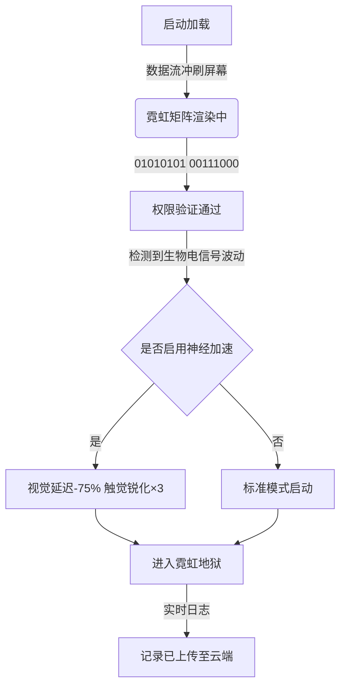
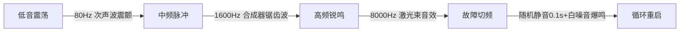

# 🌐 **进入赛博空间记录**

**时间戳**：`2077-08-15 23:47:12` **状态**：**连接成功** **警告等级**：**⚠️ 低**

**加载特效**：

- 黑色背景从边缘向中心 `0.8s渐显` ，伴随 `老式电视机雪花噪点` 音效；

- 霓虹文字以 `像素点逐行扫描` 方式浮现，每个字符出现时触发 `电子蜂鸣` 音效；

- 底部滚动显示 `[安全协议：第13次验证通过] [警告：记忆缓存区占用率89%]` 循环字幕。

# 🌌 **赛博脉冲：霓虹矩阵的动态共振**

## 📡 **数据洪流・视觉震荡**

- **流体霓虹**：#FF00FF 洋红与 #00FFFF 氰蓝如液态代码般流动，在黑色基底上切割出三维棱面，伴随 `glitch` 毛刺特效高频闪烁。

- **粒子崩解**：像素化碎片以 `120°` 角向四周迸射，每个粒子拖曳 `0.3s` 长尾，叠加 `RGB分离` 故障艺术效果。

- **全息浮动**：半透明文字层以 `Y轴0.5s正弦波动` 悬浮，边缘泛着 `#444444` 电子雾，点击触发 `数据雨` 坠落动画。

## 🤖 **机械韵律・交互脉冲**

| **元素**     | **动态参数**                                                                    | **赛博音效**            |
| ------------ | ------------------------------------------------------------------------------- | ----------------------- |
| **能量核心** | 环形结构以 `顺时针360°/s` 旋转，中心核聚变光斑每 `1.2s` 膨胀至 200% 后收缩&#xA; | `嗡鸣渐强+电流噼啪`     |
| **机械臂**   | 六轴机械臂沿 `贝塞尔曲线` 抓取漂浮芯片，关节处迸发 `#FF8000` 火花&#xA;          | `液压活塞泄气+齿轮摩擦` |
| **矩阵门**   | 垂直升降门展开时，面板浮现 `二进制数据流` （01001100 01101111…）&#xA;           | `激光充能+金属碰撞`     |

## 🎧 **音速狂飙・频率撕裂**

- **节奏切片**：4/4 拍电子鼓点以 `160BPM` 敲击，每 8 小节插入 `3.5s` 时空扭曲音效（磁带倒放 + 摩尔斯电码）。

- **人声采样**：碎片化语音（“系统过载…”“权限突破…”）经 `声码器` 处理，以 `倒放+变速` 形式穿插于高频段。

## 🌐 **次元裂缝・现实侵蚀**

- **物理世界投影**：墙面浮现 `AR全息广告` ，内容为 “硅基永生计划第 7 期”，右下角倒计时 `00:19:47` 伴随血红色警示灯。

- **空间折叠**：走廊尽头出现 `莫比乌斯环门` ，门框流动 `克莱因瓶` 拓扑结构光纹，靠近时触发 `视觉暂留重影` 副作用。

- **数据实体化**：空气中悬浮可触摸的 `立方体数据块` ，每个方块表面循环播放 `监控录像片段` （片段内容：你正在观看这段录像）。

**▶ 按下回车键，接入霓虹地狱的实时数据流 ◀**

